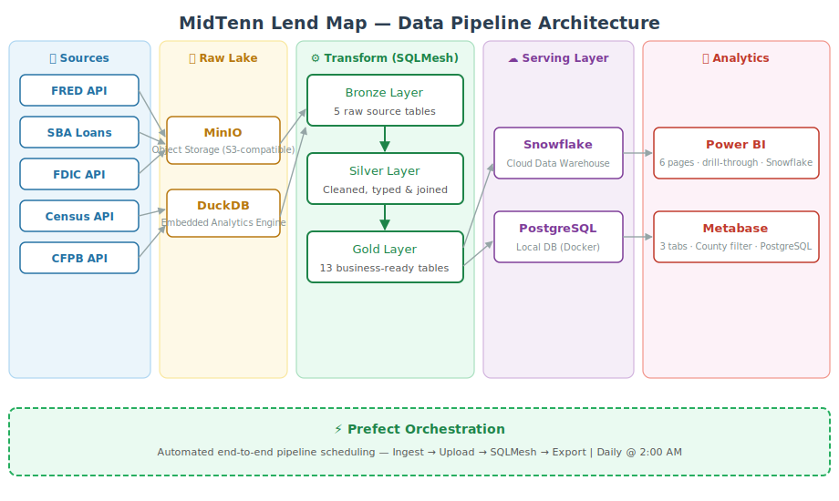

# MidTenn Lend Map

A data engineering capstone project that transforms public financial and demographic data into actionable small business lending intelligence for Middle Tennessee community banks.

## What is This Project?

Middle Tennessee has emerged as one of the fastest-growing economic regions in the U.S. Nashville consistently ranks among the top cities for startups, and the broader region has seen significant growth over the past 5 years, with major companies like Oracle, Amazon, and AllianceBernstein relocating here.

Yet local banks still rely heavily on relationships and intuition to find small business loan customers. **MidTenn Lend Map** changes that — by integrating five public data sources into a unified analytics platform, it helps community banks like Wilson Bank and Trust identify where lending demand is growing, which markets are underserved, and where the best opportunities are across Middle Tennessee counties.

Data sources include:

- **FRED (Federal Reserve)** — Interest rates and macroeconomic indicators
- **SBA (Small Business Administration)** — Small business loan approvals by region and industry
- **CFPB** — Consumer financial complaints across Middle Tennessee
- **FDIC** — Bank distribution, market share, and financial health
- **U.S. Census Bureau** — Income, poverty rate, and business demographics by county

The result: a continuously updated platform that turns open government data into a competitive intelligence tool for lending teams.

## Architecture



## System Architecture

| Technology | Purpose/Role |
|------------|--------------|
| **Python** | Main programming language |
| **Prefect** | Workflow orchestration and scheduling |
| **MinIO** | Object storage (S3-compatible) for raw data lake |
| **DuckDB** | High-performance analytical query engine |
| **SQLMesh** | ELT transformations across Bronze / Silver / Gold layers |
| **Metabase** | BI dashboards and interactive visualizations |
| **Docker** | Containerization and local environment |
| **pytest** | Unit testing framework |

## Medallion Architecture

```
Raw APIs → MinIO (raw lake) → DuckDB + SQLMesh (Bronze → Silver → Gold) → PostgreSQL → Metabase
```

- **Bronze Layer**: Raw data ingested from APIs, stored as-is in DuckDB
- **Silver Layer**: Cleaned, standardized, and deduplicated data
- **Gold Layer**: Business-ready aggregations (loan volume by county, approval rates by industry, etc.)

## Key Insights Delivered

- 📍 **Opportunity Heat Map** — Which Middle Tennessee counties have the highest unmet small business lending demand
- 🏭 **Target Industry Segments** — Which industries have the highest approval rates and growth trajectories
- 🏦 **Competitive White Space** — Where rivals are underrepresented, revealing first-mover opportunities
- ⚠️ **Risk Intelligence** — High-complaint areas and macro risk signals overlaid with opportunity data
- 📈 **Growth Trend Forecasting** — Forward-looking analysis based on population, income, and economic activity

## Installation & Local Development

1. **Clone the repository**:
```bash
git clone https://github.com/YOUR_USERNAME/MidTenn-Lend-Map.git
cd MidTenn-Lend-Map
```

2. **Install dependencies with uv**:
```bash
pip install uv        # one-time: install uv itself
uv sync               # creates .venv and installs all dependencies
```

4. **Set up environment variables**:
```bash
cp .env.example .env
# Fill in your API keys in .env
```

5. **Start services with Docker Compose**:
```bash
docker compose up -d
```

6. **Run unit tests**:
```bash
uv run pytest
```

7. **Run the Prefect pipeline locally**:
```bash
export PREFECT_API_URL="http://localhost:4200/api"
uv run python src/pipeline/main_flow.py
```

8. **Access dashboards**:
- Prefect UI: http://localhost:4200
- MinIO Console: http://localhost:9001
- Metabase: http://localhost:3001

9. **Stop services**:
```bash
docker compose down
```

## Project Structure

```
MidTenn-Lend-Map/
├── .env.example          # Environment variable template
├── .gitignore
├── docker-compose.yml
├── pyproject.toml
├── README.md
├── docs/
│   └── architecture.svg  # Pipeline architecture diagram
├── models/
│   ├── bronze/           # Raw ingestion models (5 sources)
│   ├── silver/           # Cleaned and deduplicated models
│   └── gold/             # Business-ready analytics tables (10 models)
├── src/
│   ├── ingestion/        # API ingestion scripts (FRED, SBA, CFPB, FDIC, Census)
│   └── pipeline/         # Prefect flow definitions
└── tests/                # pytest unit and data quality tests
```

## Data Coverage

**Geographic Focus**: 12 Middle Tennessee Counties
- Davidson (Nashville), Williamson (Franklin/Brentwood), Rutherford (Murfreesboro), Montgomery (Clarksville)
- Wilson (Lebanon), Sumner (Gallatin), Maury (Columbia), Putnam (Cookeville)
- Dickson, Robertson (Springfield), Bedford (Shelbyville), Coffee (Tullahoma)

**Time Range**: 2019 – Present

**Data Volume**:
- 2,300+ SBA loan records
- 52,000+ CFPB complaint records
- 152 FDIC bank institutions
- 60 Census ACS demographic snapshots (12 counties × 5 years)
- 6 FRED macroeconomic series

## Data Quality

32 automated tests run with `uv run pytest`:

- **Unit tests** — FRED and FDIC ingestion functions validated with mocks (no real API calls)
- **Bronze layer** — All 5 source tables verified to have data after ingestion
- **Silver layer** — No null approval dates, no duplicate complaint IDs, date range enforcement (2019+)
- **Gold layer** — All 9 analytics tables verified, 12 counties present, all 6 FRED series loaded

> Note: U.S. Census ACS 5-year data has a 2-year publication lag. The most recent available year is 2023. 2024–2025 population figures are estimated using historical county growth rates.